# AutoLogin-WebView2
[인하대학교 클라우드 허브](https://cloud.inha.ac.kr/) 자동 로그인

Microsoft 365 Copilot에서는 로그인 창을 WebView2로 실행시키는데,

**WebView2는 확장 프로그램이 실행되지 않는다**는 점을 간과하여 이전에 만든 확장 프로그램을 사용할 수 없었습니다.

따라서 Python의 pywinauto(윈도우 GUI 자동화 도구)를 이용해 새롭게 만들게 되었습니다.

## 실행 환경
**ONLY Windows 11** (pywinauto를 사용)

**Python** (v. 3.12.5)

## 코드 분석 시 있으면 좋은 도구
### [inspect.exe](https://learn.microsoft.com/ko-kr/windows/win32/winauto/inspect-objects)
> 검사(Inspect.exe)는 UI 요소를 선택하고 접근성 데이터를 볼 수 있는 Windows 기반 도구입니다. Microsoft UI 자동화 속성과 컨트롤 패턴 및 MSAA(Microsoft Active Accessibility) 속성을 모두 볼 수 있습니다. 또한 UI 자동화 트리에서 자동화 요소의 탐색 구조와 Microsoft Active Accessibility 계층 구조의 액세스 가능한 개체를 테스트할 수도 있습니다. - [MS Learn](https://learn.microsoft.com/ko-kr/windows/win32/winauto/inspect-objects)

설치: [Windows SDK 설치 시 inspect.exe 포함](https://go.microsoft.com/fwlink/?linkid=2313119)
> 검사 기능은 이 섹션에 설명된 모든 접근성 관련 도구를 포함하는 [Windows SDK(소프트웨어 개발 키트)](https://developer.microsoft.com/en-us/windows/downloads/windows-sdk/)의 도구 중 하나로 설치됩니다. 별도의 다운로드로 배포되지 않습니다. - [MS Learn](https://learn.microsoft.com/ko-kr/windows/win32/winauto/inspect-objects)

## 사용법 (Windows 실행 시 자동으로 프로그램 실행)
### 다운로드
1. 우측의 "Code" 버튼을 누른 후, "Download ZIP"을 선택합니다다.

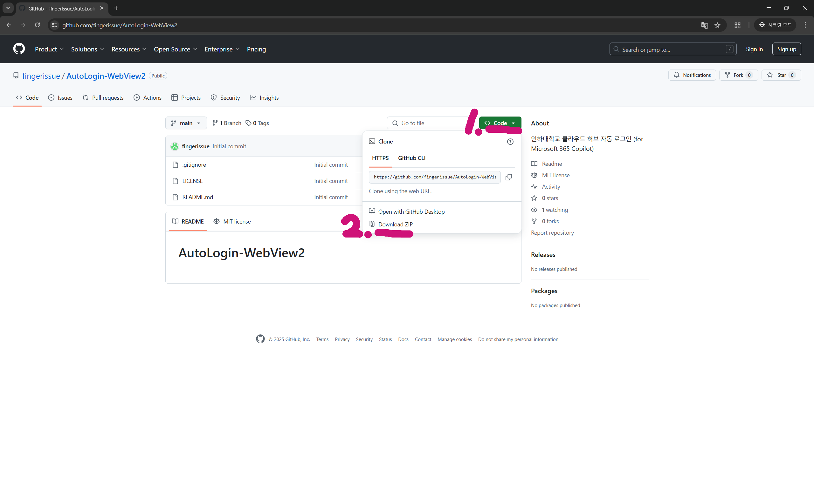

2. cmd에 아래 명령어를 입력하여 해당 모듈을 다운로드 받습니다.
> pip install python-dotenv
> 
> pip install pywinauto

그 외: 실행 시 에러나는 모듈 이름을 설치해 주세요.
> 
> pip install [모듈 이름] 

### 파일 설정
3. user-example.env 파일을 메모장으로 열어주세요
4. [id를 입력하세요] 부분에 ID를 입력하세요.
5. [password를 입력하세요] 부분에 PW를 입력 후 Ctrl+S 를 눌러 저장하세요.

|파일 설정|||
|--|--|--|
|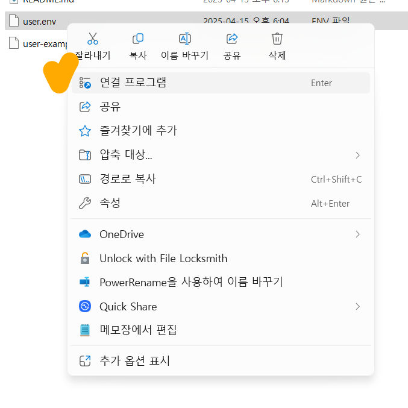|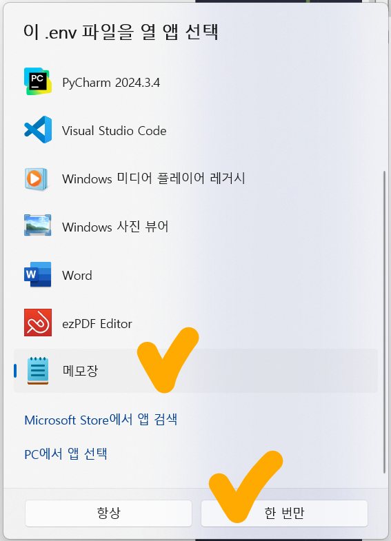|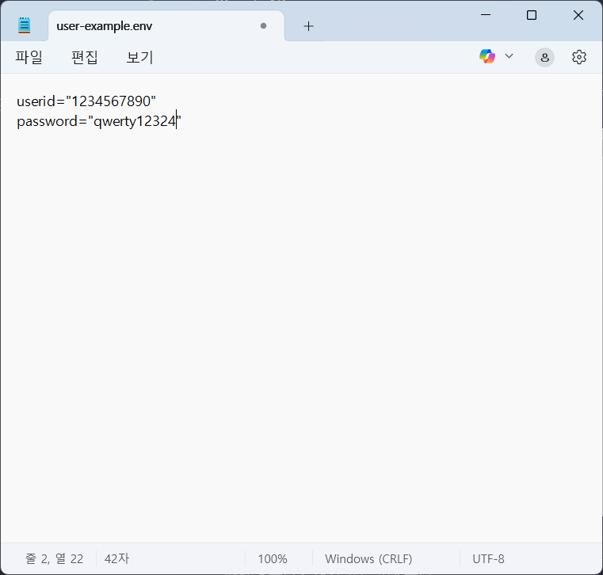|
|1. 파일 우클릭 > 연결 프로그램 클릭|2. 메모장 클릭 > 한 번만 클릭|3. ID가 1234567890 이고, PW가 qwerty12324 일 경우|

### Windows 설정
6. 작업 스케줄러를 실행하고, 우측 메뉴에서 "새 폴더"를 클릭해 원하는 이름을 작성합니다.

|작업 스케쥴러 - 폴더 생성||
|--|--|
|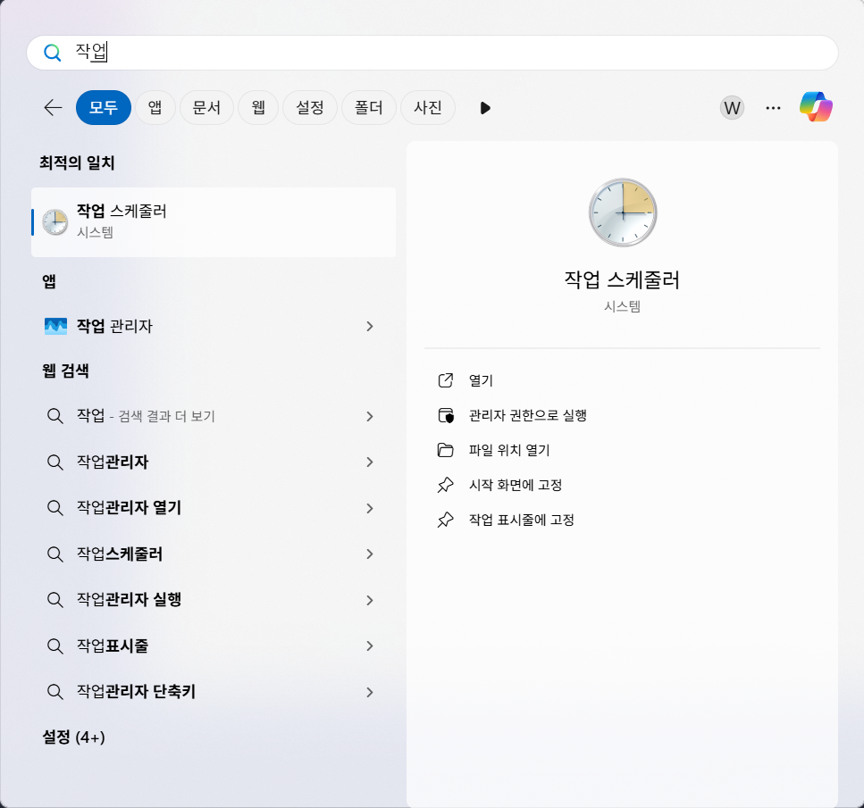|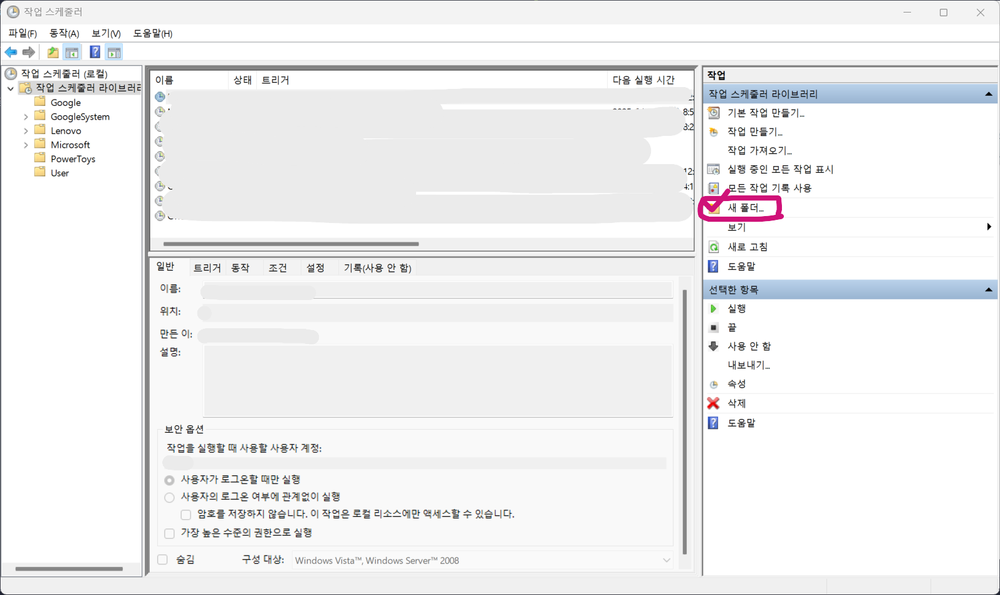|
|1. 검색|2. 작업 스케줄러의 우측 메뉴에서 "새 폴더" 클릭|
|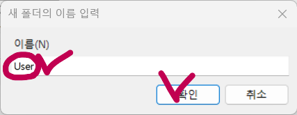|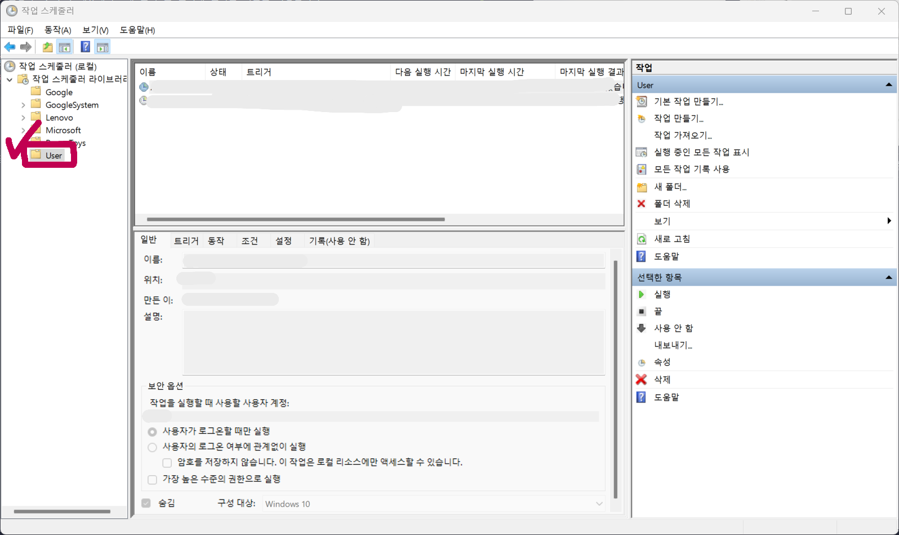|
|3. 원하는 이름 작성 후 확인 클릭|4. 좌측에서 아까 설정한 이름의 폴더를 클릭|

7. 작업을 설정합니다.

|작업 스케쥴러 - 새 작업 만들기|||
|--|--|--|
|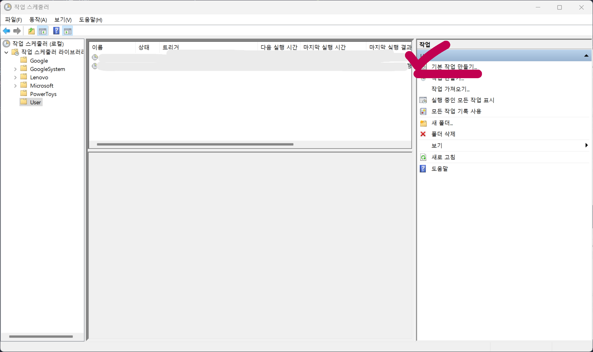|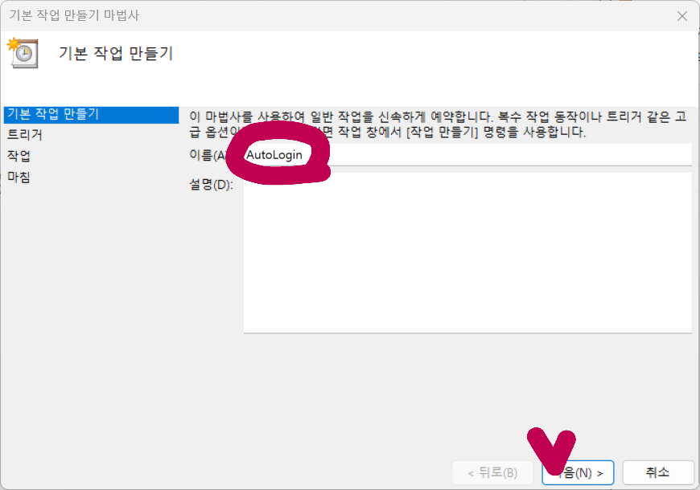|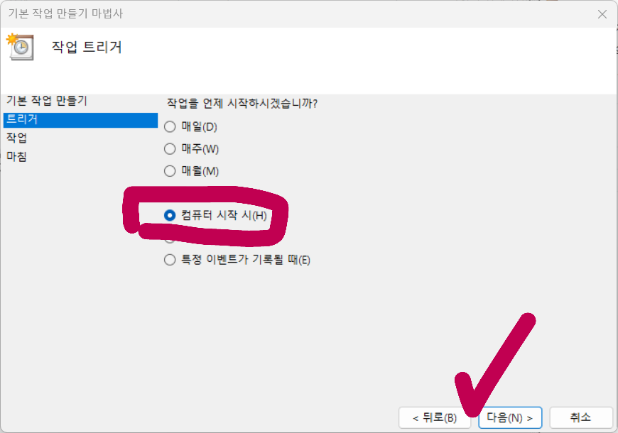|
|1. 작업 스케줄러의 우측 메뉴에서 "기본 작업 만들기..." 클릭|2. 이름(필수)과 설명(선택)을 작성 후 "다음(N)" 클릭|3. "컴퓨터 시작 시(H)"를 선택 후 "다음(N)" 클릭|
|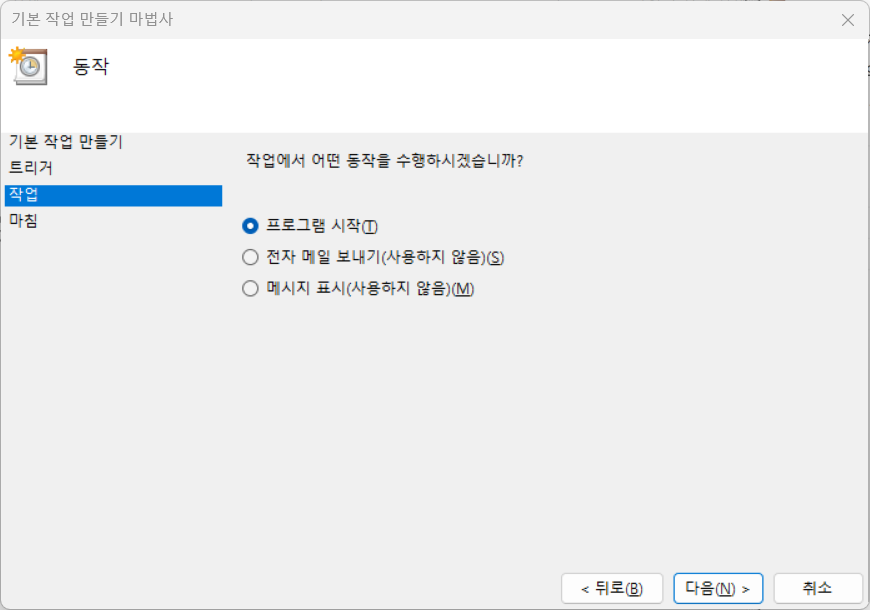|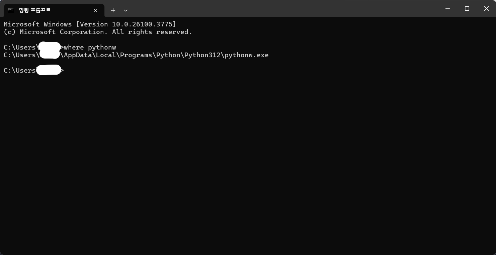|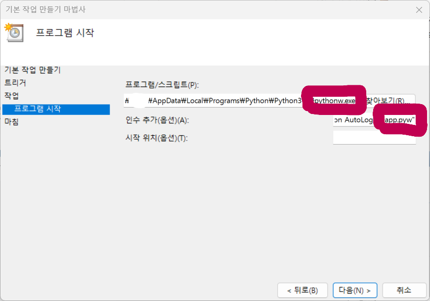|
|4. "프로그램 시작(T)"를 선택 후 "다음(N)" 클릭|5. "where pythonw" 명령어로 pythonw 위치를 찾고, 우클릭으로 복사합니다.|6. **프로그램/스크립트(P)** 에는 5번에서 찾은 **pythonw 위치**를 넣어줍니다. **인수 추가(옵션)(A)** 에는 **app.pyw 파일**을 넣어주고 "다음(N)" 클릭합니다.|
|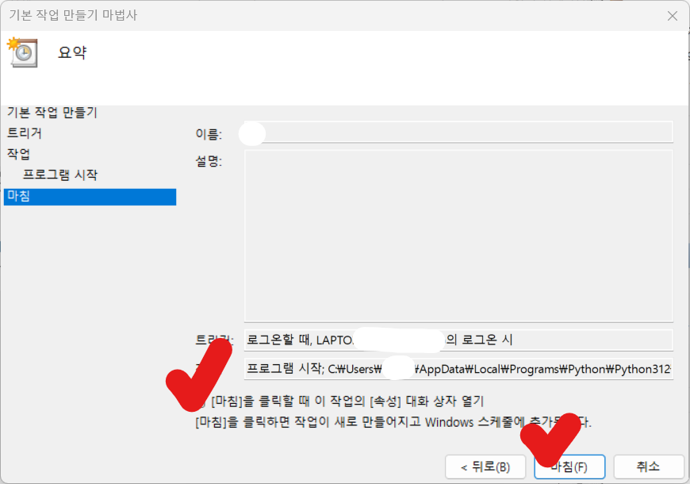||이때, pythonw 위치는 "" 없이, app.pyw는 ""가 있어야 합니다. ex. P> C:\어쩌고저쩌고\pythonw.exe ex. A> "C:\어쩌고저쩌고\app.pyw"|
|7. "[마침]을 클릭할 때 이 작업의 [속성] 대화 상자 열기"를 선택한 후, "다음(N)" 클릭합니다.|||

8. 속성에서 옵션을 바꿔줍니다.

|작업 스케쥴러 - 옵션 설정||
|--|--|
|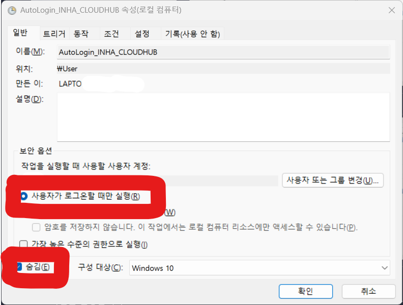|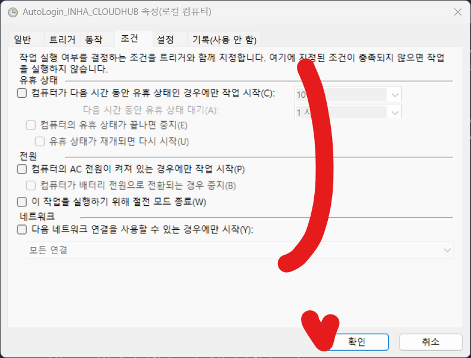|
|1. 일반 > 보안 옵션에서 "사용자가 로그온할 때만 실행(R)"과 "숨김(E)"를 선택합니다.|2. 다음과 같이 모든 옵션을 체크해제 한 후 "확인"을 누릅니다.|

9. 컴퓨터를 재부팅 한 후 실행이 잘 되고 있는지 확인합니다.

|작업 스케쥴러 - 확인|
|--|
|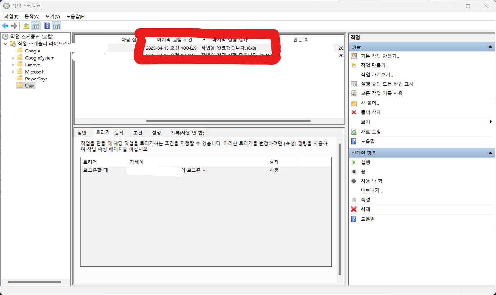|
|마지막 실행 시간과 마지막 실행 결과가 잘 나오면 성공입니다.|

## FAQ
### 1. inspect.exe 는 꼭 필요한가요?
없어도 괜찮습니다!

Application.connect(), auto_id나 control_type과 같이 프로그램 코드가 어떻게 동작하는지 분석 혹은 이와 같은 방법을 참고해서 프로그래밍하고 싶을 때만 설치하시면 됩니다.

### 2. 파일 이름이 왜 app.py 가 아니라 app.pyw 인가요?
pyw는 python file + windowless 약어로 실행 시 터미널을 띄우지 않습니다.

따라서, Alt+Tab과 같이 현재 실행 중인 창을 보여줬을 때 해당 Python 파일이 실행되는 모습이 보이지 않아서 덜 거슬리기 때문에 pyw로 선택했습니다.

만약, app.py로 실행시키고 싶을 경우 아래 명령어를 입력해야 합니다. (파일 확장자 변경 필요)
> python .\app.py
